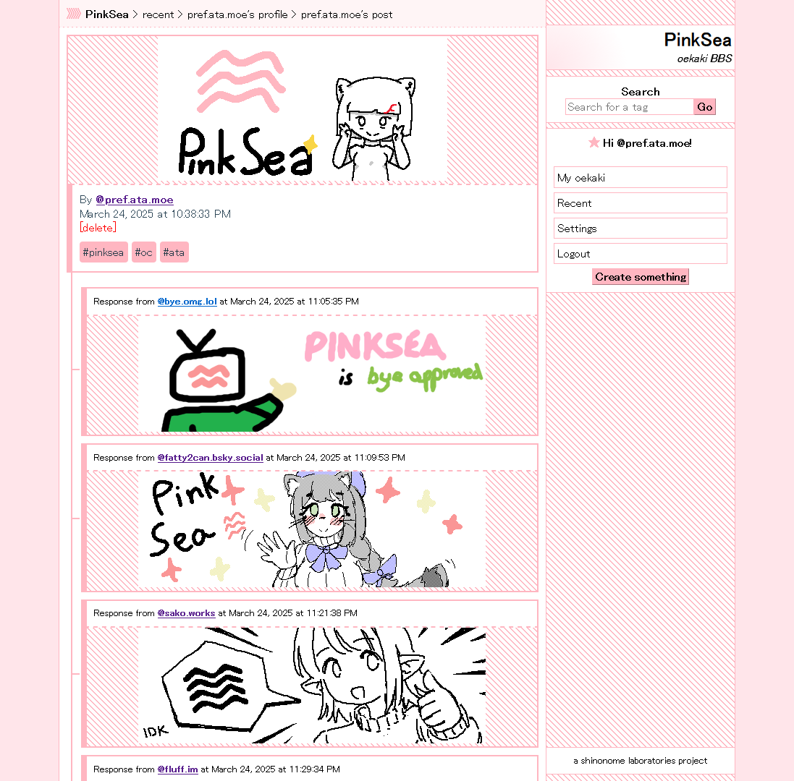

	 

A decentralized oekaki (お絵描き, jp. drawing) BBS running as an [AT Protocol AppView](https://atproto.com/guides/glossary#app-view).

It allows you to log in with your AT Protocol account and draw right in the browser using a modified variant of the [tegaki.js](https://github.com/desuwa/tegaki) editor! Your images are stored on your ATProto Personal Data Server, meaning that no PinkSea instance actually controls them. If one goes down, another one can take its place. You are in full control of everything you draw.

Other than just drawing, PinkSea allows you to tag your oekaki, grouping them together like in sites akin to Pixiv. PinkSea also permits responding with oekaki to other oekaki!

# Running (Docker)

In order to run PinkSea as a Docker container, you need to have the [Docker runtime](https://www.docker.com/) installed.

1. Clone this repository by doing `git clone https://github.com/shinolabs/PinkSea`

2. Navigate to the cloned repository.

3. Copy `.env.example` to `.env` and modify the settings according to your setup.

| ENV Config Name                         | Description                                                                                                                                   | Default Value                                            |
|----------------------------------------|-----------------------------------------------------------------------------------------------------------------------------------------------|----------------------------------------------------------|
| POSTGRES_USERNAME                      | The username used for the PostgreSQL database login                                                                                          | pinksea                                                  |
| POSTGRES_PASSWORD                      | The password used for the PostgreSQL database login                                                                                          | pinksea                                                  |
| POSTGRES_PORT                          | The port used to connect to PostgreSQL                                                                                                       | 5432                                                     |
| POSTGRES_DATABASE                      | The name of the database used for PinkSea                                                                                                    | PinkSea                                                  |
| APPVIEW_URL                            | The URL used by the AppView API                                                                                                               | https://api.your.tld                                     |
| FRONTEND_URL                           | The URL used by the frontend. (Can be the same as the AppView)                                                                               | https://your.tld                                         |
| BACKFILL_SOURCE                        | The source used for backfilling the local instance. (Can be either a relay or another PinkSea instance)                                      | https://relay1.us-west.bsky.network                      |
| BACKFILL_SKIP_DIMENSIONS_VERIFICATION | Whether to skip verifying dimensions for each oekaki post while backfilling. Will speed it up sacrificing full validity.                    | false                                                    |
| JETSTREAM_ENDPOINT                     | The ATProto [JetStream](https://github.com/bluesky-social/jetstream) endpoint used by this PinkSea instance.                                                                                | jetstream1.us-east.bsky.network                          |
| PLC_DIRECTORY                          | The [PLC directory](https://github.com/did-method-plc/did-method-plc) endpoint used by this PinkSea instance.                                                                                    | https://plc.directory                                    |
| IMAGE_PROXY_TEMPLATE                   | The image proxy endpoint used by this PinkSea instance. {0} will be populated with the author's DID, while {1} will be populated with the CID of the blob. | https://cdn.bsky.app/img/feed_fullsize/plain/{0}/{1}     |

4. Run `docker compose up -d` to start the containers and detach from them.

5. (Initial run only) Wait for PinkSea to finish backfilling all the oekaki posts.

Your PinkSea instance will now be accessible at the `FRONTEND_URL` endpoint you've specified for it, fully connected with the entire ATProto network! Simple as that!

## Updating

1. Run `docker compose down` to shut down the containers.

2. Run `git pull` to fetch the latest changes to the repository.

2. Run `docker compose up -d --build` to force rebuild all the PinkSea dockerfiles.

Your PinkSea instance should now be up-to-date!

# Running (Manual)

## Backend (AppView)

In order to run the AppView, you need the [.NET 8 SDK](https://dotnet.microsoft.com/en-us/download/dotnet/8.0) and the Entity Framework tools package, which you can install through `dotnet tools -g install dotnet-ef`.

### First-time run

1. Open the `PinkSea` folder
2. Copy the sample `appsettings.example.json` file to `appsettings.json`
	
	1. Modify the `PostgresConfig` to point to your PostgreSQL settings.
	2. Point the `AppViewConfig` URL to where your AppView will reside, this is the URL that will be used to identify your PinkSea instance. (As an example, for the official PinkSea instance, it's `https://api.pinksea.art`)
	3. (OPTIONAL) Point the `FrontendConfig` to point to where your PinkSea frontend resides. This is used for BlueSky cross-posting with a link. Leaving it blank will disallow cross-posting. (Again, as an example, for the official PinkSea instance it's `https://pinksea.art`)

3. Run `dotnet run --configuration Release` to start the PinkSea AppView. PinkSea will automatically perform migrations.

That's it! Your server now is connected to the ATmosphere and is ready to start cooperating with other PinkSea AppViews.

### Updating

1. Navigate to the `PinkSea` folder.
2. Run `dotnet ef database update` to run the migrations.
3. Once again, run `dotnet run --configuration Release` to start the server in Release mode.

## Frontend (Client app)

In order to run the client app locally, you need a fairly modern [Node.js](https://nodejs.org/en) version. Anything above Node 20 works, but I personally recommend the latest LTS version.

### Configuration

1. Navigate to `PinkSea.Frontend`.
2. Run `npm i` to download the required packages.
3. Copy the `.env.example` file to `.env`.
4. Set `VITE_PINKSEA_API_URL` to your AppView instance. (For example, for the official PinkSea instance, the endpoint is `https://api.pinksea.art`)

### Running a local server

1. Navigate to `PinkSea.Frontend`
2. Run `npm i` to update the packages.
3. Finally, execute `npm run dev`, to start a local development server with code reloading.

### Building

1. Navigate to `PinkSea.Frontend`
2. Run `npm i` to update the packages.
3. Finally, execute `npm run build`, to build and minify the client app.

The built app will be inside of the `dist` folder.

## Gateway (SSR helpers for the frontend)

### Configuration

1. Open the `PinkSea.Gateway` folder.
2. Copy the sample `appsettings.example.json` file to `appsettings.json`
3. Edit the values inside of it
	
	1. Point `AppViewEndpoint` URL to where your AppView resides. (As an example, for the official PinkSea instance, it's `https://api.pinksea.art`).
	2. Point `FrontEndEndpoint` URL to where your frontend will reside. (As an example, for the official PinkSea instance, it's `https://pinksea.art`).

4. Create the `wwwroot` folder.
5. Copy the built frontend from `PinkSea.Frontend/dist` to `wwwroot`
6. Run `dotnet run --configuration Release` to start the PinkSea gateway helper.

# Acknowledgments

PinkSea was built by these wonderful people, I'd like to extend a massive thank you to everyone involved with the project!

* [GlitchyPSI](https://bsky.app/profile/glitchypsi.xyz) for drawing the "post is missing" image visible whenever we see a post that does not exist! Thank you so much!!!
* [yazuto](https://bsky.app/profile/cryztl.bsky.social) for designing our lovely mascot PinkSea-tan! She's the cutest being ever!!
* [domatoxi](https://bsky.app/profile/domatoxi.bsky.social) for creating the default blank avatar, the PinkSea-tan silhouette. It's so cute!!

Thank you to everyone who participated in the GitHub drawing thread as well to make this README this much nicer!! All of the images in this README have been drawn by PinkSea users inside of PinkSea!

### Page screenshot

Top to bottom:

* [bye.omg.lol](https://bsky.app/profile/did:plc:3vjz7behkko4oxk5cun2jebo)
* [fatty2can.bsky.social](https://bsky.app/profile/did:plc:tyugvzks6xkrx4rqt6qsnnuo)
* [sako.works](https://bsky.app/profile/did:plc:akbwbra4o3smxvbi77aebelp)

### Header

Clockwise from the top left:

* [reileky.com](https://bsky.app/profile/did:plc:6n5bcgoq5q2d734ggiddmeph)
* [fluff.im](https://bsky.app/profile/did:plc:k6yjal5gikabksjw4kdgnpg6)
* [domatoxi.bsky.social](https://bsky.app/profile/did:plc:zndnaxckapyzp4q2yoeeyva4)
* [lyrinne.bsky.social](https://bsky.app/profile/did:plc:ru3xmujndfpilmaexvsyz6zh)
* [aikoyori.xyz](https://bsky.app/profile/did:plc:6aakz2mue7yaw4olibq3loql)
* [chimpbeef.bsky.social](https://bsky.app/profile/did:plc:e3u5a3bbv5j6hz42ew5xucng)

### Footer

Clockwise from the top left:

* [alyxia.dev](https://bsky.app/profile/did:plc:6vwpm5wzk6t4n3jenj2dl2bj)
* [murrax.dev](https://bsky.app/profile/did:plc:rr4f7bfwd32fgpbr35gy5lfb)
* [ofplayers.net](https://bsky.app/profile/did:plc:h7qqicb64fhosb6o7t5hvgwu)
* [thememesniper.dev](https://bsky.app/profile/did:plc:5wh3hjau5fsq65evluglwduk)
* [docshoebox.bsky.social](https://bsky.app/profile/did:plc:qcumxnjbtxhrpsrtn5lhglkf)
* [vescien.bsky.social](https://bsky.app/profile/did:plc:set35dzzhdxffu7cmxtljng3)

Click [here](https://pinksea.art/did:plc:vrk3nc7pk3b5kuk6y5dewnuw/oekaki/3ll5pqkgkdsvx) to visit the original thread!

# License

PinkSea's licensing is split across projects in this monorepo.

The following projects are licensed under the European Union Public License-1.2:
- PinkSea
- PinkSea.Frontend
- PinkSea.Gateway

The following libraries that PinkSea is built on top of are licensed under the Creative Commons Zero license:
- PinkSea.AtProto
- PinkSea.AtProto.Shared
- PinkSea.AtProto.Server

Please use them to build your own projects!

---

	made with love by 
	

